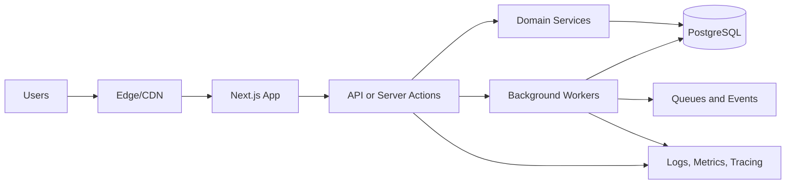

# Mohammad Radwan

I build reliable, user-focused web products with pragmatic architecture, measurable impact, and team-first engineering practices.

## Engineering Philosophy

- Build for outcomes, not hype: every technical decision should improve user value, reliability, or delivery speed.
- Strong opinions, weakly held: make a call, validate quickly, and iterate with evidence.
- Documentation is a feature: clear docs reduce onboarding time and production risk.
- Prefer simple, scalable systems: maintainability and clarity beat unnecessary complexity.

## Architecture and Mental Model

## Technical Arsenal

| Category | Core Technologies | Primary Use Case and Philosophy |
| --- | --- | --- |
| Frontend | TypeScript, React, Next.js, Tailwind CSS | Build fast, accessible interfaces with strong typing and predictable UI patterns |
| Backend | Node.js, Server Actions, API Routes, Prisma | Deliver domain logic with clear boundaries and production-safe defaults |
| Data | PostgreSQL, Prisma ORM | Keep data integrity central and evolve schema safely over time |
| Auth and Access | Clerk, role-based permissions | Secure onboarding and enforce least-privilege access by default |
| Delivery Platform | Vercel, GitHub Actions, Docker | Optimize release velocity while preserving deployment stability |
| Quality and Ops | Type checks, build gates, structured logging | Catch issues early and maintain short feedback loops |

## High-Impact Delivery

| Context | Architecture and Stack | Business Impact |
| --- | --- | --- |
| Developer blog platform | Next.js App Router, Prisma, PostgreSQL, Clerk | Shipped a production-ready publishing system with secure admin flows |
| Interactive social metrics | Server Actions, optimistic UI, DB counters | Replaced fake engagement values with real database-driven metrics |
| Comment moderation and reactions | Role-aware actions, recursive discussions, admin controls | Enabled safer community interaction with admin deletion and comment reactions |
| Team enablement | Typed patterns, reusable components, architecture docs | Improved maintainability and reduced contributor onboarding friction |

## Current Focus

I am currently deepening skills in:

- System design for high-scale web systems
- Postgres query performance and schema optimization
- Advanced frontend architecture for resilient UX
- Better observability and operational practices in production

## Lets Connect

- GitHub: [github.com/Mohammad77Radwan](https://github.com/Mohammad77Radwan)
- LinkedIn: Add your LinkedIn link
- Email: Add your email address
