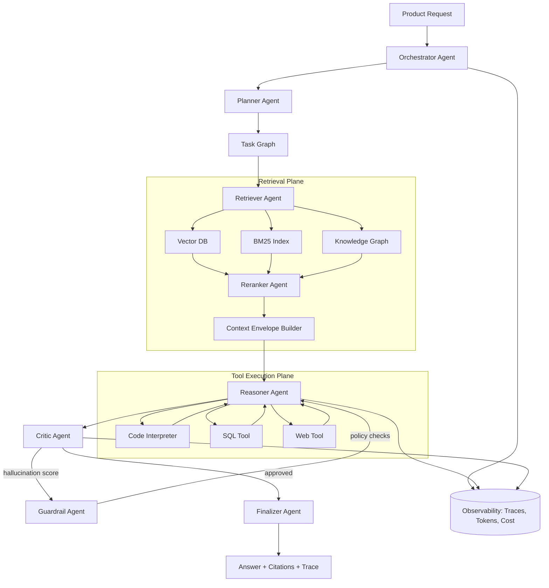
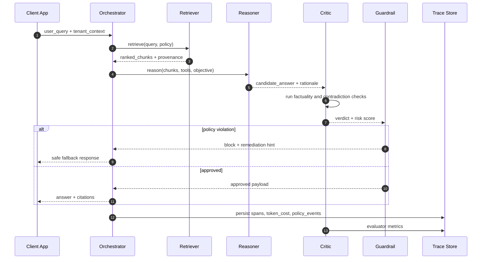

# IA en 2026: Agentic Workflows, RAG Systémique et Transformation des Métiers

En 2026, la discussion n'est plus "LLM vs non-LLM", mais "orchestration d'agents fiables dans des systèmes socio-techniques contraints". Les équipes qui performent ne déploient pas un chatbot, elles opèrent une chaîne de décision instrumentée: retrieval multi-source, raisonnement outillé, évaluation continue, et garde-fous orientés risque.

Le changement structurel pour les métiers tech est net:

- Le développeur devient concepteur de flux cognitifs distribués.
- Le Staff Engineer devient responsable de la gouvernance de la vérité (grounding, provenance, coût de preuve).
- Le SRE devient opérateur de latence cognitive (token budget, tool latency, retry policy, fallback graph).

## 1. Agentic AI: d'un prompt unique à un graphe de responsabilités

Le design moderne d'un système agentique sépare les responsabilités en agents spécialisés:

- `Planner`: transforme un objectif ambigu en plan exécutable.
- `Retriever`: récupère des preuves hétérogènes (vector, lexical, graph).
- `Reasoner`: synthétise et exécute des appels outillés.
- `Critic`: attaque la réponse candidate (cohérence, hallucination, omission critique).
- `Guardrail`: impose politiques, conformité, confidentialité.
- `Finalizer`: produit une sortie traçable avec citations.

Ce modèle réduit l'entropie des erreurs, car chaque agent peut être observé, évalué, et remplacé indépendamment.

## 2. Architecture RAG multi-agent: la vue système



### Points d'architecture qui font la différence

1. `Context Envelope Builder` doit appliquer un contrat strict: provenance, timestamp, score de pertinence, politique d'usage.
2. Le `Critic` ne doit pas partager le même prompt système que le `Reasoner` pour éviter les biais corrélés.
3. Les garde-fous doivent fonctionner en mode "deny-by-default" sur les actions outillées.
4. Chaque étape doit produire des traces structurées (`span_id`, `prompt_hash`, `tool_call_id`, `cost_usd`).

## 3. RAG en production: anti-patterns courants

### Anti-pattern A: "Top-k = 20" en dur

Le `k` optimal est dépendant du type de question et du modèle. Un `adaptive retrieval budget` améliore à la fois coût et précision.

### Anti-pattern B: index vectoriel unique

Les systèmes robustes combinent retrieval lexical + dense + graph pour réduire les angles morts.

### Anti-pattern C: absence de stratégie de contradiction

Il faut expliciter la résolution des conflits de sources (`latest-wins`, `highest-authority`, `multi-source quorum`) plutôt que de laisser le modèle improviser.

## 4. Exemple TypeScript: streaming orchestré avec AI SDK + middleware de citations

Le snippet suivant illustre une route de streaming qui:

- récupère du contexte via un retriever custom,
- enrichit le prompt avec des citations normalisées,
- stream la réponse token par token,
- expose des métadonnées de traçabilité.

```ts
import { openai } from '@ai-sdk/openai';
import { streamText, type CoreMessage } from 'ai';

interface RetrievedChunk {
  id: string;
  source: string;
  score: number;
  content: string;
  updatedAt: string;
}

interface Retriever {
  search(query: string, opts?: { k?: number }): Promise<RetrievedChunk[]>;
}

class HybridRetriever implements Retriever {
  async search(query: string, opts: { k?: number } = {}): Promise<RetrievedChunk[]> {
    const k = opts.k ?? 8;

    const [dense, lexical] = await Promise.all([
      queryDenseIndex(query, k),
      queryBm25Index(query, k),
    ]);

    const merged = dedupeById([...dense, ...lexical]);
    return rerank(merged, query).slice(0, k);
  }
}

const retriever = new HybridRetriever();

function buildContextEnvelope(chunks: RetrievedChunk[]): string {
  return chunks
    .map(
      (c, i) =>
        `[ref:${i + 1}] source=${c.source} score=${c.score.toFixed(3)} updated=${c.updatedAt}\n${c.content}`,
    )
    .join('\n\n');
}

export async function POST(req: Request): Promise<Response> {
  const body = (await req.json()) as { messages: CoreMessage[]; tenantId: string };
  const userMessage = body.messages.at(-1);

  if (!userMessage || userMessage.role !== 'user' || typeof userMessage.content !== 'string') {
    return new Response('Invalid payload', { status: 400 });
  }

  const chunks = await retriever.search(userMessage.content, { k: 10 });
  const context = buildContextEnvelope(chunks);

  const systemPrompt = [
    'Tu es un assistant technique senior. Réponds avec précision et citations.',
    'Si la réponse est incertaine, indique explicitement les inconnues.',
    'N’invente jamais de source. Utilise uniquement les refs fournies.',
  ].join(' ');

  const result = await streamText({
    model: openai('gpt-4.1-mini'),
    temperature: 0.1,
    system: `${systemPrompt}\n\nContexte:\n${context}`,
    messages: body.messages,
    experimental_telemetry: {
      isEnabled: true,
      functionId: 'rag-agentic-stream',
      metadata: {
        tenantId: body.tenantId,
        retrievedDocs: chunks.length,
      },
    },
    onFinish: async ({ usage, text }) => {
      await writeAuditEvent({
        tenantId: body.tenantId,
        promptTokens: usage?.promptTokens ?? 0,
        completionTokens: usage?.completionTokens ?? 0,
        citations: chunks.map((c) => c.id),
        outputHash: await sha256(text),
      });
    },
  });

  return result.toTextStreamResponse({
    headers: {
      'x-rag-citations': JSON.stringify(chunks.map((c) => ({ id: c.id, source: c.source }))),
      'x-rag-policy': 'strict-grounding-v2',
    },
  });
}

// Helpers (stubs)
async function queryDenseIndex(_q: string, _k: number): Promise<RetrievedChunk[]> { return []; }
async function queryBm25Index(_q: string, _k: number): Promise<RetrievedChunk[]> { return []; }
function dedupeById(chunks: RetrievedChunk[]): RetrievedChunk[] {
  const map = new Map<string, RetrievedChunk>();
  for (const c of chunks) map.set(c.id, c);
  return [...map.values()];
}
function rerank(chunks: RetrievedChunk[], _q: string): RetrievedChunk[] { return chunks; }
async function writeAuditEvent(_e: Record<string, unknown>): Promise<void> {}
async function sha256(_s: string): Promise<string> { return 'hash'; }
```

## 5. Impact concret sur les métiers

### Pour les développeurs

Le skill différenciant devient la composition d'outils et de politiques, pas la simple écriture de prompts. Les meilleurs profils savent:

- définir des contrats de contexte,
- choisir des stratégies de fallback,
- instrumenter qualité et coût au niveau requête.

### Pour les architectes

Ils passent d'une architecture "service-to-service" à "reasoning-to-tooling-to-policy". Les SLAs évoluent vers des objectifs mixtes:

- `P95 latency` + `groundedness score` + `cost/request`.

### Pour les équipes sécurité/compliance

L'IA ne peut plus être traitée comme un composant opaque. Il faut des contrôles explicites:

- redaction PII avant retrieval,
- politiques d'exfiltration par tool,
- journal d'audit signé.

## 6. Diagramme de séquence: cycle de décision d'un agent en production



## 7. Rust: pipeline de reranking SIMD-friendly pour réduire la latence

Quand le volume de chunks explose, un reranker CPU optimisé peut réduire la latence P95 sans dépendre d'un modèle cross-encoder à chaque requête. Le principe est de pré-filtrer agressivement par score hybride puis d'appliquer un reranking léger.

```rust
use std::cmp::Ordering;

#[derive(Debug, Clone)]
struct Chunk {
  id: String,
  dense_score: f32,
  lexical_score: f32,
  freshness_days: u32,
}

fn hybrid_score(c: &Chunk) -> f32 {
  // Penalise stale docs while preserving lexical precision on exact terms.
  let freshness_penalty = (c.freshness_days as f32 / 365.0).min(0.45);
  (0.62 * c.dense_score) + (0.38 * c.lexical_score) - freshness_penalty
}

fn rerank(mut chunks: Vec<Chunk>, top_k: usize) -> Vec<Chunk> {
  chunks.sort_by(|a, b| {
    hybrid_score(b)
      .partial_cmp(&hybrid_score(a))
      .unwrap_or(Ordering::Equal)
  });

  // In production, keep this branch predictable and allocation-aware.
  chunks.into_iter().take(top_k).collect()
}

fn main() {
  let chunks = vec![
    Chunk { id: "a".into(), dense_score: 0.81, lexical_score: 0.54, freshness_days: 4 },
    Chunk { id: "b".into(), dense_score: 0.73, lexical_score: 0.91, freshness_days: 33 },
    Chunk { id: "c".into(), dense_score: 0.92, lexical_score: 0.49, freshness_days: 280 },
  ];

  let ranked = rerank(chunks, 2);
  println!("top chunks: {:?}", ranked.iter().map(|c| &c.id).collect::<Vec<_>>());
}
```

## Conclusion

En 2026, l'avantage compétitif n'est pas le modèle brut, mais la capacité à opérer des systèmes agentiques fiables, observables et économiquement efficients. Le rôle des ingénieurs seniors est de transformer l'IA de "feature" en "infrastructure critique" gouvernée comme telle.
