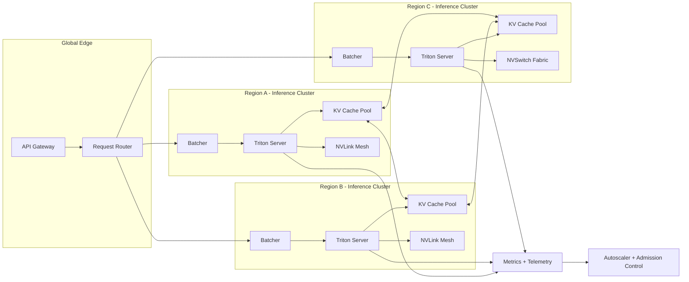
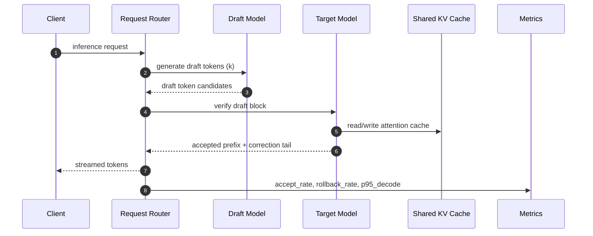

# IA Weekly: NVIDIA, Amazon, OpenAI - Lecture Bas Niveau pour Ingénieurs

Le signal de cette semaine est clair: la compétition IA se joue désormais sur trois couches couplées:

- micro-optimisation matériel (mémoire, interconnect, scheduling),
- efficacité énergétique/coût à l'entraînement,
- stratégies de raisonnement côté modèle pour maximiser la qualité par token.

## 1. NVIDIA: Tensor Cores, throughput effectif et saturation mémoire

L'erreur fréquente est de lire uniquement les TFLOPS théoriques. En pratique, le débit utile dépend de:

- la saturation HBM,
- la coalescence des accès mémoire,
- la qualité du kernel fusion,
- l'efficacité du scheduler sur les séquences variables.

### Ce qui compte en production inference

1. **Prefill vs decode**: le prefill est compute-bound, le decode devient vite memory-bound.
2. **KV cache locality**: la topologie NVLink/NVSwitch impacte directement la latence token.
3. **Quantization aware serving**: FP8/INT8 apporte un gain seulement si les kernels sont calibrés par couche.

## 2. AWS Trainium: efficacité énergétique et coût total de convergence

Trainium n'est pas uniquement une alternative coût/GPU. Son intérêt est l'optimisation end-to-end:

- pipeline compiler + graph partitioning,
- efficacité perf/watt,
- stabilité de throughput à grande échelle.

Le KPI mature n'est pas `$/heure`, mais `$/point de qualité` (par exemple `$/MMLU-point` ou `$/benchmark interne`) en tenant compte du temps de convergence.

## 3. OpenAI (o1/Strawberry): boucles de raisonnement et budget d'inférence

Les modèles de type raisonnement internalisent des étapes intermédiaires avant la réponse finale. D'un point de vue système, cela signifie:

- variance de latence plus élevée,
- consommation token non linéaire selon la complexité de la tâche,
- nécessité d'un routeur de difficulté (`easy`, `medium`, `hard`) pour contrôler le coût.

Un pattern robuste est le **dual-pass**:

- Pass 1: modèle rapide pour classification de complexité.
- Pass 2: modèle raisonneur uniquement si nécessaire.

## 4. Architecture de cluster distribué pour inference LLM



### Choix techniques recommandés

- admission control tenant-aware pour éviter la starvation,
- dynamic batching contraint par SLA (pas seulement par throughput),
- cache KV partagé + eviction policy orientée coût de recomputation.

## 5. PyTorch: optimisation mémoire avancée pour inference

Le snippet ci-dessous combine plusieurs techniques utiles:

- `inference_mode` pour réduire overhead autograd,
- autocast BF16,
- quantification dynamique des couches linéaires,
- chunked generation pour maîtriser le pic mémoire.

```python
import torch
import torch.nn as nn
from transformers import AutoModelForCausalLM, AutoTokenizer

DEVICE = "cuda"
MODEL_ID = "meta-llama/Llama-3.1-8B-Instruct"


def load_model():
    tokenizer = AutoTokenizer.from_pretrained(MODEL_ID)

    model = AutoModelForCausalLM.from_pretrained(
        MODEL_ID,
        torch_dtype=torch.bfloat16,
        low_cpu_mem_usage=True,
        device_map="auto",
    )

    # Dynamic quantization on CPU fallback layers if needed.
    # Useful in hybrid setups where 일부 layers are offloaded.
    model.lm_head = torch.quantization.quantize_dynamic(
        model.lm_head,
        {nn.Linear},
        dtype=torch.qint8,
    )

    model.eval()
    return tokenizer, model


def generate_stream(tokenizer, model, prompt: str, max_new_tokens: int = 256, chunk: int = 32):
    inputs = tokenizer(prompt, return_tensors="pt").to(DEVICE)

    generated = inputs["input_ids"]

    with torch.inference_mode(), torch.autocast(device_type="cuda", dtype=torch.bfloat16):
        remaining = max_new_tokens
        while remaining > 0:
            step = min(chunk, remaining)
            out = model.generate(
                input_ids=generated,
                max_new_tokens=step,
                do_sample=False,
                use_cache=True,
                pad_token_id=tokenizer.eos_token_id,
            )
            new_tokens = out[:, generated.shape[1]:]
            generated = out
            remaining -= step

            # Optional: release cached allocator pressure between chunks
            torch.cuda.synchronize()

            yield tokenizer.decode(new_tokens[0], skip_special_tokens=True)


if __name__ == "__main__":
    tokenizer, model = load_model()
    for piece in generate_stream(tokenizer, model, "Explique les trade-offs FP8 vs BF16 en inference."):
        print(piece, end="", flush=True)
```

## 6. Ce que cela change pour les équipes produit/plateforme

- Les roadmaps doivent intégrer des objectifs de coût d'inférence par feature.
- Les équipes plateforme doivent exposer des primitives de routing intelligent (modèle, région, niveau de raisonnement).
- Les équipes applicatives doivent mesurer la qualité comme une fonction du budget compute.

## 7. Spéculative decoding: séquence d'optimisation latence



Un `accept_rate` faible (< 45%) signifie souvent que le draft model n'est pas aligné sur la distribution du target model. Dans ce cas, le coût de vérification peut annuler le gain de latence.

## 8. Routeur de coût intelligent pour modèles de raisonnement

Le routeur suivant applique un budget de tokens et choisit un profil modèle en fonction de la complexité perçue.

```ts
type Difficulty = 'easy' | 'medium' | 'hard';

interface RouteDecision {
  model: 'fast' | 'reasoning';
  maxOutputTokens: number;
  temperature: number;
}

function estimateDifficulty(prompt: string): Difficulty {
  const hasMath = /proof|derive|solve|theorem|complexity/i.test(prompt);
  const hasLongContext = prompt.length > 2200;
  const multiStep = /compare|trade-off|plan|architecture/i.test(prompt);

  if ((hasMath && multiStep) || (hasLongContext && multiStep)) return 'hard';
  if (hasMath || hasLongContext || multiStep) return 'medium';
  return 'easy';
}

export function routeInference(prompt: string, tenantBudgetTokens: number): RouteDecision {
  const difficulty = estimateDifficulty(prompt);

  if (tenantBudgetTokens < 3_000) {
    return { model: 'fast', maxOutputTokens: 256, temperature: 0.1 };
  }

  if (difficulty === 'hard') {
    return { model: 'reasoning', maxOutputTokens: 1400, temperature: 0.0 };
  }

  if (difficulty === 'medium') {
    return { model: 'fast', maxOutputTokens: 700, temperature: 0.1 };
  }

  return { model: 'fast', maxOutputTokens: 350, temperature: 0.2 };
}
```

## Conclusion

NVIDIA, AWS et OpenAI convergent vers une même réalité: l'avantage n'est plus dans un benchmark isolé, mais dans l'optimisation conjointe du triptyque **matériel, orchestration, raisonnement**. Les organisations qui gagnent sont celles qui traitent l'inférence IA comme un système distribué critique, pas comme une API monolithique.
