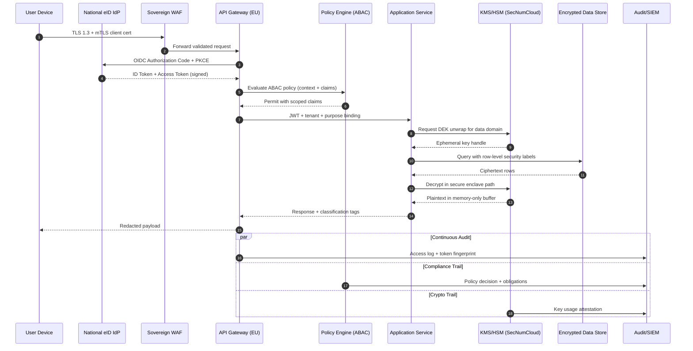
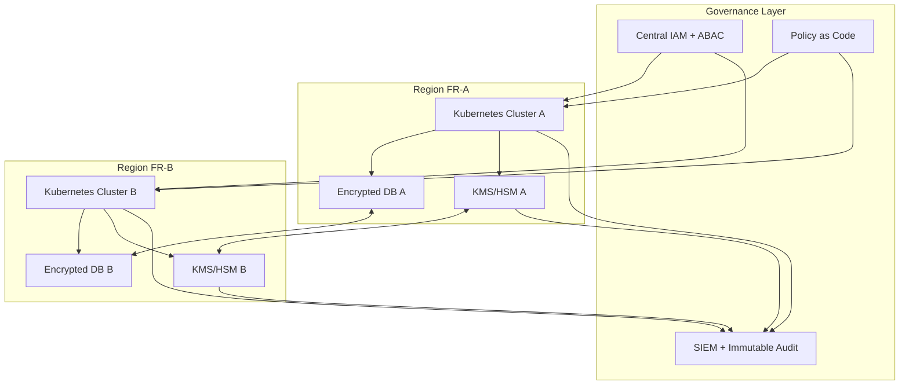

# Souveraineté Numérique Française: Architecture, Conformité et Résilience Opérationnelle

Construire une plateforme "souveraine" ne consiste pas seulement à héberger des VMs en Europe. La souveraineté est un système de garanties techniques, juridiques et opérationnelles:

- contrôle des clés cryptographiques,
- isolation administrative,
- traçabilité inviolable,
- conformité continue (et non ponctuelle).

Dans un contexte français, trois cadres structurent la décision d'architecture: **SecNumCloud**, **RGPD**, et l'interopérabilité de type **Gaia-X**.

## 1. SecNumCloud: implications techniques concrètes

SecNumCloud impose un niveau d'exigence élevé sur plusieurs axes:

1. **Gouvernance et administration**: séparation stricte des rôles, accès bastionnés, journalisation complète.
2. **Cryptographie**: gestion robuste des clés, rotation, protection HSM, séparation des environnements.
3. **Résilience**: PRA/PCA testés, segmentation réseau, mécanismes anti-latéralisation.
4. **Chaîne de confiance**: durcissement hôte, patching maîtrisé, inventaire et preuves d'intégrité.

Conséquence pour l'architecture applicative: la conformité doit être codée comme un ensemble de contraintes d'infrastructure et de policies runtime.

## 2. Gaia-X: portabilité, fédération et preuve de contrôle

Gaia-X n'est pas un "cloud provider", c'est un cadre de fédération pour garantir:

- portabilité des workloads et des données,
- transparence contractuelle et technique,
- interopérabilité entre écosystèmes européens.

Sur le terrain, cela pousse vers:

- des APIs normalisées,
- des politiques de data residency explicitement attachées aux datasets,
- des métadonnées de gouvernance transportables.

## 3. Référence d'authentification Zero-Trust en architecture hybride souveraine



## 4. Pattern d'architecture recommandé (OVHcloud / Scaleway)

### Principes

- Multi-zone active/active pour les services stateless.
- Stateful en active/passive avec réplication chiffrée et tests réguliers de bascule.
- Chiffrement applicatif des données sensibles avant persistance.
- Journal d'audit append-only exporté vers un domaine d'observabilité isolé.

### Contrôles RGPD by design

- Data minimization au niveau schéma et événements.
- Purge automatisée (TTL légal) orchestrée par policy engine.
- Traçabilité des finalités (`purpose binding`) sur chaque accès.
- Droit à l'effacement implémenté en workflow transactionnel vérifiable.

## 5. Exemple Kubernetes: déploiement sécurisé orienté conformité

```yaml
apiVersion: v1
kind: Namespace
metadata:
  name: sovereign-app
  labels:
    compliance.secnumcloud/profile: "strict"
    data.residency/region: "fr-eu"
---
apiVersion: policy/v1
kind: PodDisruptionBudget
metadata:
  name: api-pdb
  namespace: sovereign-app
spec:
  minAvailable: 2
  selector:
    matchLabels:
      app: api
---
apiVersion: apps/v1
kind: Deployment
metadata:
  name: api
  namespace: sovereign-app
spec:
  replicas: 3
  selector:
    matchLabels:
      app: api
  template:
    metadata:
      labels:
        app: api
        security.zero-trust/enforced: "true"
    spec:
      serviceAccountName: api-sa
      automountServiceAccountToken: false
      securityContext:
        seccompProfile:
          type: RuntimeDefault
      containers:
        - name: api
          image: registry.eu.example.com/sovereign/api:1.8.4
          ports:
            - containerPort: 8080
          env:
            - name: REGION_LOCK
              value: "fr-eu"
            - name: KMS_ENDPOINT
              value: "https://kms.sovereign.local"
          resources:
            requests:
              cpu: "500m"
              memory: "1Gi"
            limits:
              cpu: "2"
              memory: "2Gi"
          securityContext:
            allowPrivilegeEscalation: false
            readOnlyRootFilesystem: true
            runAsNonRoot: true
            capabilities:
              drop: ["ALL"]
          livenessProbe:
            httpGet:
              path: /healthz
              port: 8080
            initialDelaySeconds: 10
            periodSeconds: 15
          readinessProbe:
            httpGet:
              path: /readyz
              port: 8080
            initialDelaySeconds: 5
            periodSeconds: 10
---
apiVersion: networking.k8s.io/v1
kind: NetworkPolicy
metadata:
  name: default-deny-all
  namespace: sovereign-app
spec:
  podSelector: {}
  policyTypes:
    - Ingress
    - Egress
---
apiVersion: networking.k8s.io/v1
kind: NetworkPolicy
metadata:
  name: allow-api-to-kms-and-db
  namespace: sovereign-app
spec:
  podSelector:
    matchLabels:
      app: api
  policyTypes:
    - Egress
  egress:
    - to:
        - namespaceSelector:
            matchLabels:
              name: sovereign-kms
      ports:
        - protocol: TCP
          port: 443
    - to:
        - namespaceSelector:
            matchLabels:
              name: sovereign-db
      ports:
        - protocol: TCP
          port: 5432
```

## 6. Runbook minimal pour exploitation souveraine

- Test trimestriel de restauration de backup avec preuve horodatée.
- Rotation des secrets et clés de service automatisée (max 90 jours).
- Contrôle continu des dérives IaC (drift detection + remédiation).
- Revue mensuelle des accès privilégiés et des obligations RGPD.

## 7. Vue contrôle: landing zone souveraine multi-région



## 8. Policy-as-Code (OPA/Rego): blocage explicite hors région autorisée

Ce type de policy empêche le déploiement de workloads non conformes à la résidence des données.

```rego
package sovereign.admission

default allow = false

required_region := "fr-eu"

allow {
  input.request.kind.kind == "Deployment"
  region := input.request.object.metadata.labels["data.residency/region"]
  region == required_region
  secure_context(input.request.object.spec.template.spec.containers)
}

secure_context(containers) {
  every c in containers {
    c.securityContext.runAsNonRoot == true
    c.securityContext.allowPrivilegeEscalation == false
    c.securityContext.readOnlyRootFilesystem == true
  }
}

deny_reason[msg] {
  not allow
  msg := "deployment rejected: non-compliant residency or security context"
}
```

## Conclusion

La souveraineté numérique est un problème d'architecture d'ensemble: conformité codée, sécurité active, gouvernance traçable, et résilience testée. Les organisations qui réussissent ne "cochent" pas SecNumCloud, elles industrialisent un modèle d'exploitation où la preuve de contrôle est native au système.
